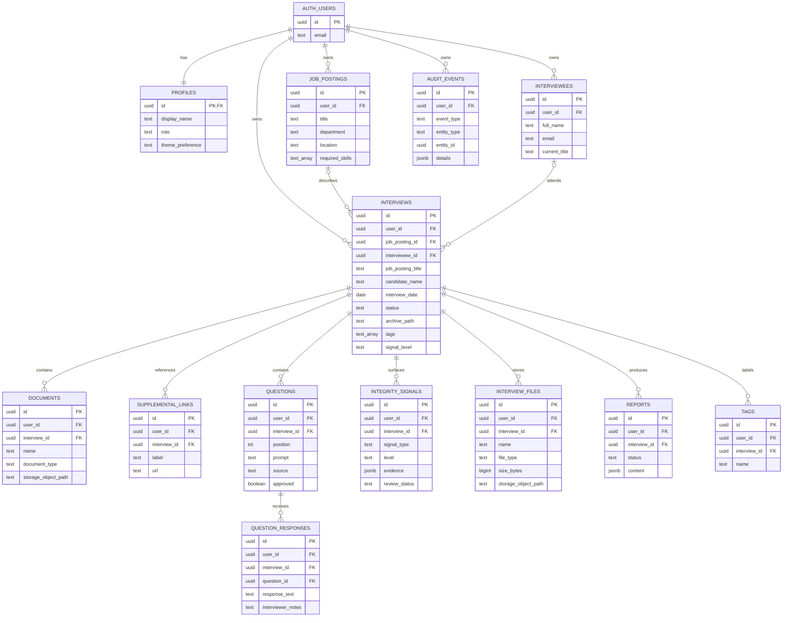

# Ghost PostgreSQL EER

The physical schema is defined by `supabase/migrations`. Supabase Auth owns credentials and sessions in the `auth` schema; application records live in `public` and reference `auth.users(id)`.



## Ownership Invariants

- `profiles.id` is the Auth user UUID.
- Every owned table uses a non-null `user_id` referencing `auth.users(id)` with cascading account deletion.
- Owned parent tables expose a unique `(id, user_id)` key.
- Child foreign keys contain both the parent ID and `user_id`, so records cannot cross owner boundaries.
- Interview archive paths are unique per user, not globally.
- Storage metadata paths must begin with `<user_id>/`.
- RLS derives visibility from `auth.uid()`, not from browser filters.

## Lifecycle and Audit

Interview status is constrained to:

```text
Draft -> UploadsComplete -> QuestionsReady -> InInterview -> Completed -> Archived
```

The API validates sequential transitions. Database triggers append audit events when an interview is created, its status changes, or a profile is updated. Authenticated users can read their audit events but cannot directly insert, update, or delete them.

## Files

`documents` and `interview_files` store metadata and private object paths. Binary data belongs in the private `interview-files` Storage bucket. The first object-path segment must match the authenticated user's UUID.
