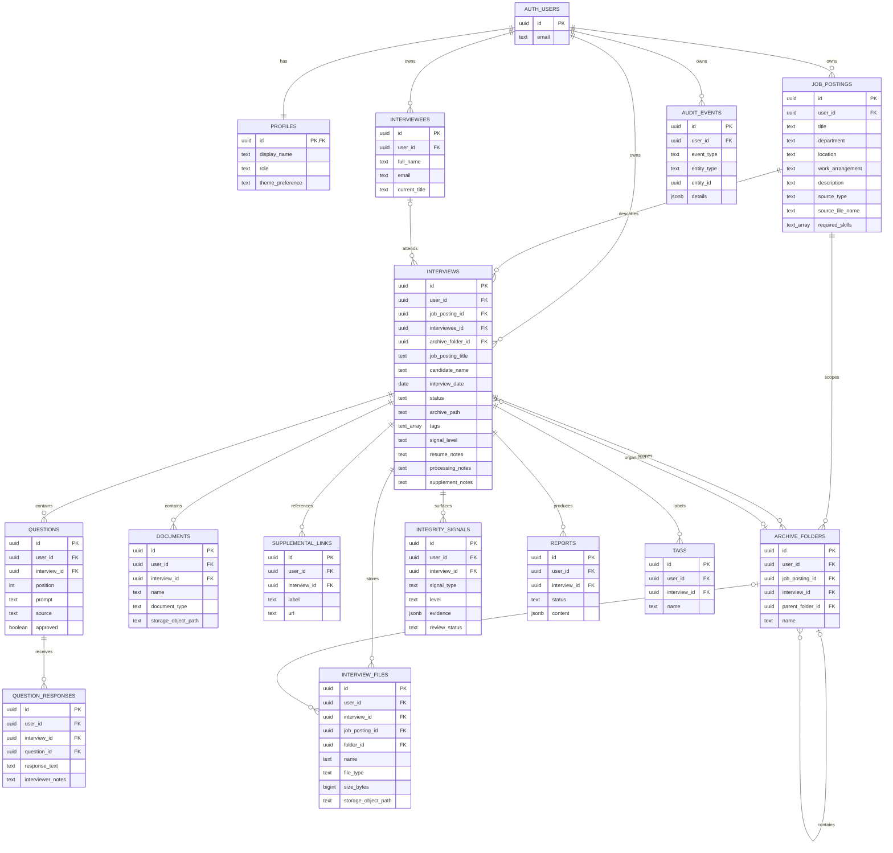

# Ghost PostgreSQL EER

The physical schema is defined by `supabase/migrations`. Supabase Auth owns credentials and sessions in the `auth` schema; application records live in `public` and reference `auth.users(id)`.



## Ownership Invariants

- `profiles.id` is the Auth user UUID.
- Every owned table uses a non-null `user_id` referencing `auth.users(id)` with cascading account deletion.
- Owned parent tables expose a unique `(id, user_id)` key.
- Child foreign keys contain both the parent ID and `user_id`, so records cannot cross owner boundaries.
- Interview archive paths are unique per user, not globally.
- Every interview references an owned job posting; the source-link migration backfills legacy title-only interviews before enforcing this requirement.
- Storage metadata paths must begin with `<user_id>/`.
- Job-posting file metadata includes the owned `job_posting_id`; non-posting files cannot claim that relationship.
- Custom archive folders are real `archive_folders` rows. Their job, interview, and parent references include the owner boundary.
- An interview may optionally reference an owner-matched root or position directory through `archive_folder_id`. A database trigger rejects interview-scoped folders and directories belonging to another position; deleting that directory safely returns the interview to its default position folder.
- Files may reference only a custom folder belonging to the same interview and owner.
- RLS derives visibility from `auth.uid()`, not from browser filters.

## Lifecycle and Audit

Interview status is constrained to:

```text
Draft -> UploadsComplete -> QuestionsReady -> InInterview -> Completed -> Archived
```

The API validates sequential transitions. Database triggers append audit events when an interview is created, its status changes, or a profile is updated. Authenticated users can read their audit events but cannot directly insert, update, or delete them.

## Files

`documents` and `interview_files` store metadata and private object paths. Binary data belongs in the private `interview-files` Storage bucket. The first object-path segment must match the authenticated user's UUID.

`job_postings` and `interviews` are the persisted position and candidate-folder records. `archive_folders` stores user-created root, position, interview, and nested folders. Optional `interviews.archive_folder_id` placement lets a candidate interview appear in a selected root or matching-position directory. Export manifests translate those database records and private file metadata into relative paths inside a downloaded ZIP without treating browser display state as the source of truth.

## Workspace Creation

`create_interview_workspace` is a security-invoker PostgreSQL function called with the authenticated user's JWT. In one transaction it creates or reuses an owned job posting, creates the interviewee and interview, persists the optional archive directory, and inserts supplemental links, manual questions, and uploaded-file metadata. It derives ownership from `auth.uid()`, rejects cross-owner position and directory IDs, and requires each object path to begin with `<auth-user-id>/<interview-id>/`.

Job postings default to `source_type = 'manual'`. A before-insert trigger on `interview_files` recognizes `file_type = 'Job Posting'`, derives the owned position through the interview, assigns the composite owner-safe `job_posting_id`, and changes the position source to `upload` with its source filename. This keeps manual-only positions valid while making uploaded source files directly queryable from their position.
