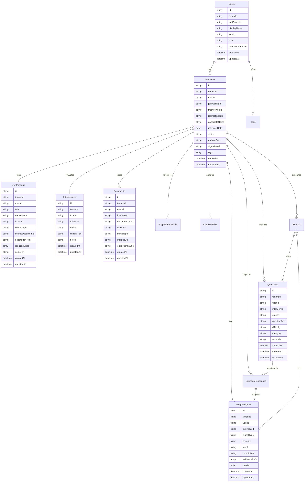

# Ghost Logical EER / Cosmos DB Container Design

Ghost uses Azure Cosmos DB for NoSQL. Cosmos DB is document-oriented, so this EER is a **logical model** rather than a physical relational schema. The physical implementation uses containers, partition keys, app-level references, and JSON documents.

## Logical EER Diagram



## Containers

| Container | Partition key | Why it exists | App connection |
|---|---:|---|---|
| `Users` | `/tenantId` | Stores signed-in Teams or app users. | Drives homepage, settings, ownership, and archive filtering. |
| `Interviews` | `/userId` | Central interview ledger. | Powers archive root, candidate folders, status, signal level, and export grouping. |
| `JobPostings` | `/userId` | Stores uploaded or pasted job posting context. | Used by question generation and folder naming. |
| `Interviewees` | `/userId` | Stores candidate identity and context. | Used for candidate folder, reports, and generated question personalization. |
| `Documents` | `/userId` | Stores metadata for uploaded PDFs, resumes, transcripts, and CVs. | Binary files should live in Blob Storage; Cosmos stores pointers. |
| `SupplementalLinks` | `/userId` | Stores GitHub, portfolio, personal site, or other approved links. | Used by the resume/CV/link upload step and question generation. |
| `Questions` | `/userId` | Stores generated and manually provided questions. | Used by the question dashboard and final interview set. |
| `QuestionResponses` | `/userId` | Captures candidate responses mapped to questions. | Supports evidence packets and transcript references. |
| `IntegritySignals` | `/userId` | Stores review-only signals such as response latency or inconsistent answer patterns. | Powers the Signals tab and post-interview report. |
| `InterviewFiles` | `/userId` | Stores archive-visible file records. | Powers candidate file ledger and export ZIP manifest. |
| `Reports` | `/userId` | Stores generated evidence and integrity reports. | Powers report screen and exported packet. |
| `Tags` | `/userId` | Stores user-defined and system tags. | Powers archive filters and interview organization. |
| `AuditEvents` | `/userId` | Stores important app events. | Useful for traceability and future compliance review. |

## Status State Machine

```text
Draft -> UploadsComplete -> QuestionsReady -> InInterview -> Completed -> Archived
```

## Guardrail Rules

- Integrity signals are **review indicators**, not proof of cheating.
- Ghost should not automatically reject candidates.
- `overallScore` or signal severity must not be treated as a hiring decision.
- Large files should be stored outside Cosmos DB, usually in Blob Storage.
- All candidate data should be treated as sensitive hiring data.
- The application layer enforces relationships because Cosmos DB does not enforce relational foreign keys.
